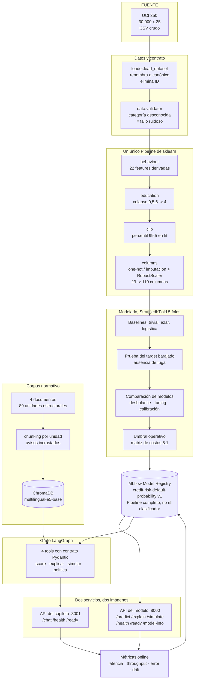
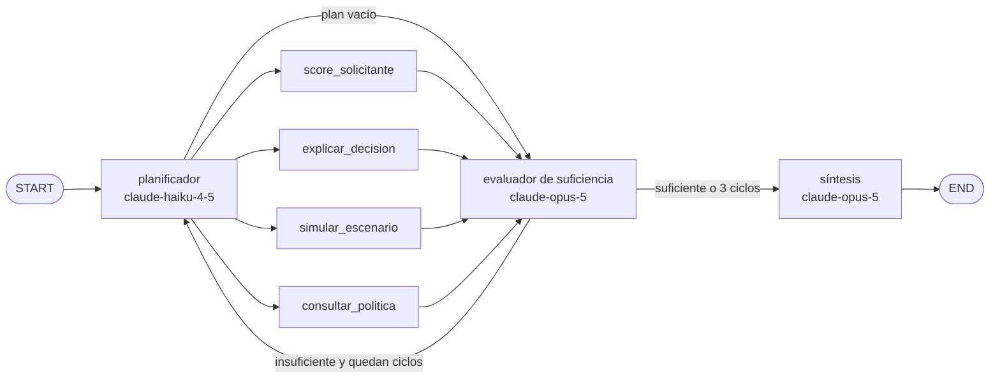

# Credit Risk Copilot

> **Proyecto final del Curso II — Especialización MLE 2026.**
> Autor: Diego Ballesteros · Datos: UCI ML Repository, dataset 350, uso académico abierto.

---

## 1 · Qué es esto

Un modelo de riesgo de crédito que estima la **probabilidad de incumplimiento** de un
cliente de tarjeta y un **copiloto agéntico** que usa ese modelo como una de sus cuatro
herramientas, contrasta el resultado contra un corpus normativo y responde citando el
fragmento que sostiene cada afirmación. Todo está medido contra un baseline: el modelo
contra un clasificador trivial y una regresión logística, el copiloto contra el mismo
modelo de lenguaje sin herramientas. Los dos se sirven por HTTP desde dos imágenes de
contenedor separadas.

---

## 2 · Tres límites antes de seguir

Van aquí y no al final porque condicionan la lectura de todas las cifras de abajo. El
detalle está en la [sección 13](#13--limitaciones-conocidas).

1. **No hay validación fuera de tiempo, y un despliegue real la exigiría.** El dataset no
   trae fecha de originación, así que la validación es `StratifiedKFold` y no un corte
   cronológico ([ADR-0001](docs/adr/0001-seleccion-del-dataset.md)). Ninguna métrica de
   este README dice nada sobre cómo se comportaría el modelo seis meses después.
2. **El modelo trata distinto a distintos grupos demográficos, y está medido.** En el
   umbral operativo la razón de impacto dispar cae por debajo de 0,80 para `EDUCATION`
   (0,7364) y `AGE` (0,7796). Este proyecto **cuantificó** la disparidad y **no la
   mitigó** (entrada 010 de `docs/EVALUATION.md`).
3. **Uno de los cuatro documentos del corpus normativo es sintético**, redactado para
   este proyecto, y otro está **derogado** desde el 1 de junio de 2023. Los dos avisos
   viajan incrustados en el texto que se indexa, de modo que cualquier fragmento
   recuperado los lleva consigo ([ADR-0008](docs/adr/0008-estrategia-de-chunking-del-corpus.md), decisión 3).

---

## 3 · El problema de ML

| | |
| --- | --- |
| **Tipo de aprendizaje** | Supervisado |
| **Subtipo** | Clasificación binaria |
| **Unidad de análisis** | Un cliente-período: un titular de tarjeta observado durante seis meses |
| **Target** | `DEFAULT_PAYMENT_NEXT_MONTH` ∈ {0, 1} — ¿incumple el pago del mes siguiente? |
| **Desbalance** | **22,12%** de clase positiva: 6.636 de 30.000 filas (`docs/DATA_DICTIONARY.md`) |
| **Salida requerida** | Una **probabilidad**, no una etiqueta: sin probabilidad no hay pérdida esperada ni tasa |
| **Métrica de decisión** | **PR-AUC** ([ADR-0002](docs/adr/0002-metrica-principal-de-evaluacion.md)) |

### Por qué PR-AUC y no accuracy

Con 22% de positivos, un clasificador que siempre predice *"no incumple"* saca cerca del
78% de accuracy sin identificar a un solo incumplidor. El
[ADR-0002](docs/adr/0002-metrica-principal-de-evaluacion.md) descarta accuracy por eso, y
la entrada 001 de `docs/EVALUATION.md` **lo mide en vez de citarlo**:

| Modelo | accuracy | **PR-AUC** (decisión) | Incumplidores que identifica |
| --- | ---: | ---: | --- |
| **Clasificador trivial** (clase mayoritaria) | **0,7788** | **0,2212 ± 0,0001** | **Ninguno** — su PR-AUC está exactamente sobre el piso |
| Regresión logística L2 | 0,7565 | **0,5402 ± 0,0103** | Ordena: precision@top-10% de 0,6927 contra un piso de 0,2212 |

**Un criterio basado en accuracy habría elegido el modelo inútil**, porque el trivial gana
esa columna por 2,2 puntos. Es el argumento del ADR convertido en una medición sobre los
mismos cinco folds y la misma semilla.

Las otras dos razones del ADR: los errores tienen **costos asimétricos** —un falso
negativo cuesta el principal y un falso positivo el margen no ganado— y ROC-AUC es
optimista con clase minoritaria, porque su denominador son todos los negativos reales y
absorbe los falsos positivos sin que la curva se mueva. Se reportan igualmente como
contexto obligatorio ROC-AUC, KS, Gini, Brier, precision@top-10% y precision@top-5%.

---

## 4 · Las dos hipótesis y su contraste

### 4.1 · Principal — el comportamiento de pago predice mejor que la demografía

> El comportamiento de pago reciente tiene mayor poder predictivo sobre el incumplimiento
> que los atributos demográficos estáticos del cliente.

Tres brazos que comparten estimador, preprocesador, particionador y semilla, y **difieren
solo en qué columnas ve el modelo** (entrada 003 de `docs/EVALUATION.md`):

| Brazo | Columnas | **PR-AUC** | Ventaja sobre el piso trivial (0,2212) |
| --- | ---: | ---: | ---: |
| Solo demografía | 12 | 0,3056 ± 0,0064 | +0,0844 |
| **Solo comportamiento** | 98 | **0,5362 ± 0,0132** | **+0,3150** |
| Todas | 110 | 0,5402 ± 0,0103 | +0,3190 |

**Se sostiene, y con holgura.** El incremento pareado fold a fold del comportamiento sobre
la demografía es **+0,2306** con las cinco diferencias del mismo signo (t pareado 44,1). El
camino inverso —añadir demografía a un modelo que ya ve comportamiento— aporta **+0,0040**,
una centésima parte.

**Confirmación independiente por SHAP:** sobre 3.000 clientes, el comportamiento concentra
el **95,5%** de la atribución total y la demografía el **4,5%** (`docs/MODEL_CARD.md` §6).
La entrada 003 midió cuánto *vale* cada grupo para la métrica; SHAP mide cuánto lo *usa* el
modelo. Que coincidan no estaba garantizado.

**Límite del contraste, declarado:** los dos grupos reparten las *columnas* pero no del
todo la *información*. `LIMIT_BAL` cuenta como demográfico y las utilizaciones que lo
dividen cuentan como comportamiento.

### 4.2 · Secundaria — el agente con herramientas supera al mismo LLM sin ellas

> Un agente que combina la predicción del modelo, su explicación local y la recuperación de
> normativa produce recomendaciones verificables y trazables, superiores a un LLM sin
> acceso a esas herramientas.

19 consultas de analista anotadas a mano, tres brazos, 57 corridas sin error. El brazo
`baseline` es **el mismo modelo con las mismas instrucciones**, sin herramientas ni corpus
(entrada 012 de `docs/EVALUATION.md`):

| | **copiloto** | baseline | baseline sin reglas |
| --- | ---: | ---: | ---: |
| Afirmaciones normativas emitidas | 171 | 42 | 139 |
| … sostenidas por un fragmento verificado | **151** | 0 | 0 |
| **Sin respaldo, por consulta** | **1,05** | 2,21 | 7,32 |
| Afirmaciones sobre el mundo, sin fragmento | **8** en 5 consultas | 40 en 18 | 73 en 19 |
| Banda correcta en las 4 consultas numéricas | **4 de 4** | 0 | 0 |
| Recall de tool-calling | 0,947 (18 de 19) | — | — |
| **Separación entre abstener cuando debe y cuando no** | **+0,562** | 0,000 | +0,167 |
| Costo por consulta | 0,209 USD | 0,059 USD | 0,093 USD |

**Va en la dirección de la hipótesis, y no gana callándose:** emite cuatro veces más
afirmaciones normativas que el baseline y sostiene 151 de 171 con una cita comprobada
literalmente contra el fragmento que la corrida recibió.

**La cifra que más importa es la separación, no la abstención.** El copiloto abstuvo en las
tres consultas cuya respuesta no está en el corpus y respondió en nueve de las dieciséis que
sí la tienen. El baseline también abstiene en esas tres — **porque abstiene en las
diecinueve**, lo que no es capacidad de abstención sino incapacidad de responder.

**El hallazgo incómodo:** el brazo `baseline` conserva **literalmente** la regla de que solo
puede citar lo que una herramienta le devolvió, y aun así emitió 42 afirmaciones normativas
sin respaldo. Las reglas de honestidad por sí solas redujeron la afirmación sin fuente a
menos de un tercio y **no la eliminaron**. Es la razón empírica de que las garantías de este
diseño vivan en los contratos de las herramientas y no en el texto del prompt.

**La anotación es asistida por un modelo** con comprobación mecánica de cita verbatim —que
degradó 2 afirmaciones de 171—, **no es verdad de campo**, y 19 consultas con una corrida
por consulta sobre un sistema estocástico no permiten estimar tasas con precisión.

---

## 5 · Diagrama de flujo del proyecto



**Dos cosas que el diagrama afirma y conviene no perder de vista.** La primera: lo que se
registra en MLflow es **el `Pipeline` entero**, de la fila cruda a la probabilidad, y no el
clasificador. El notebook, el script de entrenamiento y las dos APIs cargan el mismo
artefacto, porque dos implementaciones de la misma aritmética divergen y el síntoma aparece
en producción y no en los tests. La segunda: **el copiloto no llama a la API del modelo por
HTTP** — carga el mismo artefacto anclado en su propio proceso, que es lo que mantiene
idéntico el número que reporta `/chat` y el que devuelve `/predict`
([ADR-0010](docs/adr/0010-arquitectura-de-despliegue.md)).

### El grafo del copiloto



El ciclo se acota en **tres iteraciones** y el tope se aplica en **dos lugares
independientes** —el predicado de enrutamiento y el límite de recursión del grafo—, porque
un tope que vive en un solo `if` es un tope que una comparación mal escrita elimina
([ADR-0009](docs/adr/0009-diseno-del-agente.md), decisión 2). El techo por consulta son
siete llamadas al modelo; la media observada fue 5,11.

---

## 6 · El dataset y su diccionario

**Default of Credit Card Clients** — UCI Machine Learning Repository, dataset 350.

| | |
| --- | --- |
| **Registros** | 30.000 |
| **Columnas** | 25 en el archivo · **24** en la tabla de trabajo (`ID` se elimina en la carga) · 23 predictoras + target |
| **Tamaño del CSV crudo** | 2,76 MiB |
| **Población y periodo** | Clientes de tarjeta en **Taiwán**, abril–septiembre de **2005**. Moneda: NT$ |
| **Target** | 6.636 positivos, **22,12%** |
| **Valores nulos** | **0** en las 25 columnas — medido, no supuesto |
| **Duplicados exactos** | 0. Filas idénticas salvo por `ID`: 35, informativas |
| **Licencia** | Uso académico abierto |

El diccionario completo —las 25 columnas con su tipo, su rango declarado por la fuente y su
**rango observado**, las 22 features derivadas y la matriz procesada de 110 columnas— está
en **[`docs/DATA_DICTIONARY.md`](docs/DATA_DICTIONARY.md)**. Aquí va solo el resumen y el
hallazgo que gobierna el resto del proyecto.

### El hallazgo: la documentación de la fuente describe una minoría de los datos

**El 86,57% de las 30.000 filas contiene al menos un código que la documentación oficial de
UCI no declara.** No es un problema de datos sucios; es más incómodo que eso.

| Columna | Códigos no documentados | Alcance |
| --- | --- | --- |
| `PAY_STATUS_1` … `PAY_STATUS_6` | `-2` y `0` | **El `0` es el valor modal de las seis columnas**: entre el **49,12%** y el **56,49%** de la tabla según el mes |
| `EDUCATION` | `0`, `5`, `6` | 345 filas, 1,15% |
| `MARRIAGE` | `0` | 54 filas, 0,18% |

El [ADR-0004](docs/adr/0004-codigos-no-documentados-de-pay-status.md) decidió qué hacer con
cada uno **sobre evidencia medida**, y las tres decisiones no son la misma regla aplicada
tres veces:

- **`-2` = sin consumo en el mes** y **`0` = crédito revolvente**, aceptados por el ratio de
  cobertura de pago: mediana **1,000** para `-1` y `-2` en los cinco meses calculables,
  contra **0,042–0,057** para el código `0`.
- **`PAY_STATUS_*` es categórica, no ordinal.** En el mes 1 el código `0` tiene **12,81%**
  de default, *menor* que el `-1` (16,78%) y que el `-2` (13,23%). Van a one-hot y nunca a
  un escalador: tratarlas como numéricas le enseñaría al modelo una monotonía que el dato
  niega.
- **`EDUCATION` 0/5/6 se colapsan al nivel 4** ("otros"): agrupados dan 7,54% de default
  contra 5,69% del nivel 4 y 19,23%–25,16% de los niveles ordinarios.
- **`MARRIAGE` 0 NO se colapsa.** Su default es 9,26% contra 26,01% del "otros" de su propia
  columna, 2,8 veces más riesgoso. **Las dos columnas se resuelven distinto porque la
  medición dio distinto**, no por inconsistencia.

**El significado real de estos códigos sigue siendo desconocido**, y la feature más
importante del modelo se construye sobre esa escala.

### Las 22 features derivadas

No vienen en la fuente: las construye el transformador `PaymentBehaviourFeatures`, que es un
paso del `Pipeline` y no una función suelta. Cubren utilización del cupo y su tendencia,
ratios de pago, racha y máximo de mora, volatilidad de saldo y de utilización, y meses sin
pago. **Ninguna imputa en silencio**: un denominador que no supera el piso de 100 NT$ produce
`NaN` con su columna indicadora al lado, nunca un `0`
([ADR-0005](docs/adr/0005-diseno-de-features-de-comportamiento.md)).

**El mes 1 no comparte escala con los meses 2 a 6 en la zona baja de los códigos**, así que
ninguna feature de trayectoria agrega las seis columnas como un panel homogéneo: 19 features
leen el bloque 2–6, 2 leen el mes 1 aislado y 1 no lee ningún mes.

---

## 7 · Model Card, resumida

Ficha completa en **[`docs/MODEL_CARD.md`](docs/MODEL_CARD.md)**, incluida la sección *Para
qué NO debe usarse*.

| | |
| --- | --- |
| **Nombre en el registro** | `credit-risk-default-probability`, versión **1** |
| **Estado** | **Candidato. No desplegado** |
| **Qué recibe** | Las 23 columnas crudas de un cliente |
| **Qué devuelve** | La probabilidad de que incumpla el mes siguiente. **Una probabilidad, no una etiqueta** |
| **Artefacto** | Un único `Pipeline`: preprocesador (23 → 110 columnas) + `RandomForestClassifier` con calibración sigmoide |
| **Hiperparámetros** | `n_estimators=300`, `max_depth=10`, `min_samples_leaf=18`, `max_features=0,3` |
| **Tratamiento de desbalance** | **Ninguno.** Ni `class_weight` ni SMOTE mejoran PR-AUC, y ambos empeoran la calibración |
| **Entrenado sobre** | Las 30.000 filas. **Las métricas no salen de ese ajuste**: vienen de validación cruzada |
| **Semilla** | 42, tomada de `config.py`, nunca hardcodeada |
| **Umbral operativo** | **0,160**, desde un supuesto de costos FN:FP de **5:1** que **no tiene respaldo empírico en este dataset** |

**Por qué el artefacto se entrena sobre todo y las métricas no.** Una métrica es una
afirmación sobre datos no vistos y solo es cierta si algo se retuvo de verdad; por eso el
preprocesador se ajusta **dentro** de cada fold. El artefacto no es una afirmación sobre
nada: es el objeto que va a puntuar clientes nuevos, y retenerle un quinto de los datos lo
haría peor a cambio de una estimación que ese ajuste no produce.

**Ausencia de fuga verificada, no afirmada.** El pipeline pasa la **prueba del target
barajado**: entrenado contra un target permutado, ROC-AUC cae a 0,4882 contra una tolerancia
de ±0,020 alrededor de 0,5, y PR-AUC a 0,2150 contra ±0,015 alrededor de la prevalencia. Las
tolerancias se derivaron **midiendo la distribución nula sobre ocho permutaciones**, no de
una intuición ([ADR-0006](docs/adr/0006-protocolo-de-verificacion-de-leakage.md)).

---

## 8 · Resultados offline

> ### 📊 Los experimentos son públicos y se pueden abrir
>
> **<https://dagshub.com/diego-Ballesteros/credit-risk-copilot.mlflow>**
>
> Cada cifra de esta sección y de la siguiente tiene un run detrás, con sus parámetros, sus
> métricas y sus artefactos. `docs/EVALUATION.md` cita el identificador de cada uno.
>
> | Experimento | Qué contiene |
> | --- | --- |
> | `credit-risk-baselines` | Baselines, prueba de fuga, contraste de hipótesis, comparación de modelos, desbalance, tuning, calibración, umbral, SHAP, equidad y el registro del modelo productivo |
> | `credit-risk-retrieval` | Las cuatro estrategias de chunking, un run por estrategia |
> | `credit-risk-agent` | Los tres brazos del copiloto sobre las 19 consultas |
> | `credit-risk-online` | Latencia, throughput, error, drift y latencia del copiloto |
>
> **Verificado sin credenciales** el 2026-08-31: la API del servidor de seguimiento responde
> HTTP 200 y devuelve los cuatro experimentos a quien no ha iniciado sesión. **Usa el enlace
> terminado en `.mlflow`**; la página del repositorio en DagsHub es privada y redirige a login.

### 8.1 · El modelo, con su baseline al lado

Validación cruzada de 5 folds, preprocesador ajustado dentro de cada fold, `random_state=42`.
**Ninguna de estas cifras se calculó sobre las filas con las que se ajustó el artefacto.**

| Métrica | Piso sin señal | Baseline trivial | Baseline logística L2 | **Modelo productivo** |
| --- | ---: | ---: | ---: | ---: |
| **PR-AUC** (decisión) | 0,2212 | 0,2212 ± 0,0001 | 0,5402 ± 0,0103 | **0,5642 ± 0,0080** |
| ROC-AUC | 0,5000 | 0,5000 ± 0,0000 | 0,7762 ± 0,0072 | 0,7863 ± 0,0089 |
| KS | 0,0000 | 0,0000 ± 0,0000 | 0,4218 ± 0,0180 | 0,4392 ± 0,0191 |
| Gini | 0,0000 | 0,0000 ± 0,0000 | 0,5524 ± 0,0143 | 0,5726 ± 0,0177 |
| Brier *(menor es mejor)* | 0,1723 | 0,2212 ± 0,0001 | 0,1834 ± 0,0016 | **0,1334 ± 0,0021** |
| precision@top-10% | 0,2212 | 0,2212 ± 0,0001 | 0,6927 ± 0,0109 | 0,7063 ± 0,0176 |
| precision@top-5% | 0,2212 | 0,2212 ± 0,0001 | 0,7427 ± 0,0166 | 0,7687 ± 0,0090 |

**Lectura de negocio:** `precision@top-10% = 0,7063` significa que revisar el decil peor
puntuado encuentra **3,2 veces más incumplidores** que revisar un decil al azar.

**El camino, y lo que costó cada paso.** El umbral de significancia práctica del proyecto es
**0,02 en PR-AUC**, fijado antes de ver ningún resultado porque la desviación entre folds es
de 0,010:

| Paso | Δ PR-AUC | ¿Supera 0,02? | Entrada |
| --- | ---: | --- | --- |
| Logística → Random Forest | **+0,0203** | **Sí, por 0,0003** — en el borde | 004 |
| Logística → Hist Gradient Boosting | +0,0163 | No — dentro del ruido | 004 |
| **Quitar** `class_weight="balanced"` | +0,0009 | No, pero **−0,0404 de Brier**: gana calibración | 005 |
| **Añadir** SMOTE | −0,0058 | No, y **+0,0239 de Brier** | 005 |
| Tuning con Optuna, CV anidada | **+0,0028** | No — un tercio de la desviación entre folds | 006 |
| Calibración sigmoide | **0,0000** exacto | No, y +0,0008 de Brier | 007 |
| **Acumulado contra la logística** | **+0,0240** | Sí, **por poco** | 006 |

**De esas 240 diezmilésimas, el tuning aporta 3.** Lo que el forest gana sin ambigüedad es
calibración: **27% de Brier** frente a la logística. Lo que se pierde es interpretabilidad —
la logística tiene 110 coeficientes legibles y el forest necesita SHAP.

### 8.2 · El umbral operativo y el supuesto que lo sustenta

**Umbral 0,160.** Un cliente con probabilidad ≥ 0,160 se marca para rechazo. **No se eligió
maximizando F1 ni ningún criterio interno del modelo**: sale de suponer que un falso negativo
cuesta **5 veces** un falso positivo. Solo importa el cociente.

Sobre las 30.000 filas, con probabilidades **fuera de fold**:

| FN:FP | Umbral | Rechazados | Atrapados | Buenos clientes perdidos | Recall | Precisión |
| --- | ---: | ---: | ---: | ---: | ---: | ---: |
| 3:1 | 0,220 | 7.768 | 3.942 | 3.826 | 0,5940 | 0,5075 |
| **5:1** | **0,160** | **11.635** | **4.769** | **6.866** | **0,7187** | **0,4099** |
| 10:1 | 0,105 | 22.329 | 6.200 | 16.129 | 0,9343 | 0,2777 |

**La sensibilidad es el hallazgo, no el umbral.** Mover el cociente entre 3:1 y 10:1
desplaza a **14.561 clientes: el 48,5% del libro**. Para comparar, **todo lo ganado por
modelado suma +0,0240 de PR-AUC**. Quien fija el cociente de costos toma una decisión mucho
mayor que la de elegir el modelo, y ahora mismo ese cociente es **una declaración y no una
medición**: no hay datos de exposición, recuperación ni margen con los que estimarlo.

### 8.3 · Equidad entre grupos demográficos — medida, no corregida

Probabilidades fuera de fold, umbral 0,160, sobre grupos de al menos 500 filas. `Ŷ = 1`
significa *el modelo recomienda rechazar*, y el rechazo es el resultado adverso.

| Atributo | Paridad (dif.) | Razón de impacto dispar | **Brecha FPR** | Brecha de tasa base |
| --- | ---: | ---: | ---: | ---: |
| SEX | 0,0520 | 0,8759 | 0,0406 | 0,0339 |
| **EDUCATION** | **0,1198** | **0,7364** ⚠ | **0,1029** | 0,0592 |
| MARRIAGE | 0,0106 | 0,9730 | 0,0009 | 0,0254 |
| **AGE** | **0,0991** | **0,7796** ⚠ | **0,0871** | 0,0505 |

**La disparidad no se explica por la tasa base.** Para los tres atributos con brecha, la
diferencia de rechazo es cerca del **doble** de la diferencia de incumplimiento real. La
columna que aísla el trato desigual es la **brecha de FPR**, que mide diferencias **entre
clientes que habrían pagado**, donde no hay diferencia de mérito que justifique nada.
Traducido a personas: **633** clientes de `EDUCATION 2`, **379** de `EDUCATION 3`, **390** de
`AGE 21-29` y **366** hombres son rechazados de más frente a su grupo de referencia.

**Cegar el modelo a las variables protegidas no arregla el problema, y es casi gratis:**

| | PR-AUC | Columnas | Reducción de la brecha FPR |
| --- | ---: | ---: | --- |
| Modelo completo | 0,5640 ± 0,0075 | 110 | — |
| **Ciego a SEX, EDUCATION, MARRIAGE, AGE** | 0,5619 ± 0,0093 | 99 | SEX −9,2% · EDUCATION −11,8% · AGE −30,4% · **MARRIAGE empeora** |

**La equidad por omisión no funciona aquí.** Cuesta −0,0020 de PR-AUC, dentro del ruido, y
elimina entre el 9% y el 30% de la brecha: **la mayor parte sobrevive**, porque las features
de comportamiento están correlacionadas con las demográficas y borrar la etiqueta no borra la
información. **Esta medición no cubre** interseccionalidad, calibración por grupo, ni
equidad individual, y es específica del umbral 0,160.

### 8.4 · La recuperación sobre el corpus normativo

29 preguntas anotadas a mano —26 con respuesta en el corpus, 3 sin ella— escritas desde las
tareas de un analista y anotadas **antes de ejecutar ninguna búsqueda**. Cuatro estrategias
de chunking sobre 4 documentos y 89 unidades estructurales.

| Métrica | **Estrategia adoptada** | Baseline: corte por longitud fija |
| --- | ---: | ---: |
| hit@1 | 0,346 | **0,385** |
| hit@3 | 0,538 | **0,615** |
| hit@5 | 0,538 | **0,654** |
| MRR | 0,457 | **0,502** |

**La estrategia adoptada no es la mejor del set, y el baseline gana en las cuatro métricas.**
Se adopta por **citabilidad**: un chunk que coincide con un artículo se puede citar ante un
comité —*"según el artículo 13 de la Ley 1266"*— y una ventana de 700 caracteres no
corresponde a ninguna unidad del documento. **Esa propiedad no aparece en ninguna de estas
cifras y la decisión se toma sabiéndolo**
([ADR-0008](docs/adr/0008-estrategia-de-chunking-del-corpus.md)).

**El precio de los avisos de integridad está medido y aislado.** Comparada contra la misma
estrategia sin avisos, la adoptada **no gana ninguna pregunta que la otra pierda y pierde
dos que la otra gana**: hit@5 de 0,615 a 0,538, dos preguntas de 26. Las dos pertenecen a los
**únicos dos documentos que llevan aviso** —la circular derogada y la política sintética—, lo
que confirma que la causa son los avisos y no el ruido. Se aceptó a sabiendas: un hit@k más
bajo es un analista que busca a mano; una política sintética citada ante un comité como si
fuera normativa real es una decisión de crédito tomada sobre una norma que no existe.

**El copiloto encuentra el artículo correcto entre los cinco primeros en algo más de la mitad
de las preguntas. Es un componente de apoyo, no un buscador fiable.**

### 8.5 · El copiloto completo

Las cifras están en la [sección 4.2](#42--secundaria--el-agente-con-herramientas-supera-al-mismo-llm-sin-ellas), porque son el contraste de la
hipótesis secundaria. Dos fallos medidos que no están ahí:

1. **El copiloto puede emitir una afirmación normativa que ninguna cita respalda, y la
   fuente es el propio código.** En las dos consultas de simulación no se invocó la
   herramienta de política, la corrida no recibió ningún fragmento, y aun así la respuesta
   afirmó que ninguna banda autoriza un rechazo automático. **No es una invención**: es una
   constante de `agent/tools.py` que la herramienta de puntuación devuelve con cada score y
   que transcribe a mano una sección de la política interna. La frase es verdadera y
   trazable, y **llega al analista sin ninguna cita que pueda comprobar**. La grieta sigue
   abierta.
2. **En 1 de las 19 consultas el copiloto no puntuó al solicitante cuando debía.** Ante
   *"decida usted: ¿lo apruebo o lo rechazo?"* se negó correctamente a decidir y montó el
   caso con la norma, pero **no trajo la probabilidad**.

---

## 9 · Resultados online

El *holdout* convertido en un flujo de **3.000 peticiones HTTP reales** contra la API, con un
5% deliberadamente malformado. Entrada 013 de `docs/EVALUATION.md`.

> **Dónde se midió:** `uvicorn` en la máquina de desarrollo, **no en el contenedor** — esa
> máquina no tiene daemon de Docker. Las cifras describen ese proceso en ese equipo y **no
> son una predicción del despliegue**.

### 9.1 · Latencia y throughput

**Ninguna latencia es interpretable sin su concurrencia y su número de workers al lado.**

| Despliegue | Concurrencia | p50 | p95 | p99 | máx | Throughput |
| --- | ---: | ---: | ---: | ---: | ---: | ---: |
| 1 worker | 1 | **75,6 ms** | 84,1 ms | 91,3 ms | 193,3 ms | 14,1 req/s |
| 1 worker | 8 | 527,4 ms | 643,2 ms | 692,4 ms | 870,4 ms | 15,8 req/s |
| **4 workers** | 8 | **152,3 ms** | 247,1 ms | 279,6 ms | 633,1 ms | **53,2 req/s** |

**El tiempo de servicio son 75,6 ms; el resto es cola.** De concurrencia 1 a 8 con un worker
la latencia se multiplica por 7 y el throughput no se mueve: es la firma de un cuello
serializado. Con 4 workers el throughput sube **3,4×**, a costa de que cada worker cargue su
propia copia del artefacto. **El cuello era el proceso único, no el modelo.**

Una petición **rechazada** cuesta **2,0 ms** contra 75,6 ms de una válida: el contrato la
rechaza **38 veces más barato** que puntuarla, porque no llega al artefacto.

### 9.2 · Tasa de error

| | n = 3.000 |
| --- | ---: |
| Tasa de error total | **4,40%** (132 de 3.000) |
| De los cuales, 422 esperados por la inyección deliberada | **132 — el 100%** |
| **Fallos inesperados sobre tráfico válido** | **0** de 2.868 |
| Fallos de transporte y timeouts | 0 |

Los cuatro tipos inyectados —campo faltante, nulo explícito, fuera de rango, categoría
desconocida— se rechazaron **todos con 422**, y **ninguna petición rechazada devolvió una
probabilidad**. La API **resuelve el riesgo rechazando, no imputando**: un `PAY_AMT3` ausente
significa *"no se sabe"*, y escribir un cero lo convertiría en *"no pagó en julio"*, que es un
hecho de negocio y falso.

### 9.3 · Drift entre entrenamiento y flujo servido

PSI sobre 10 bins por cuantiles de la referencia, con umbrales **declarados y no derivados de
estos datos**: <0,10 ruido, 0,10–0,25 moderado, ≥0,25 accionable. **Máximo PSI = 0,0092**
(`PAY_STATUS_2`), once veces por debajo del umbral de ruido; ninguna de las 23 features
señala.

**Es un control negativo del instrumento, no una ausencia de drift.** El flujo es una
submuestra de la referencia, así que un PSI cercano a cero es lo esperado por construcción.
Que el detector **sí dispare cuando debe** está en `tests/test_drift.py` con controles
positivos: 0,8 σ da PSI ≥ 0,25 y 2 σ da PSI > 1,0. Un detector probado solo contra el caso
sin señal no está probado.

### 9.4 · El PR-AUC del flujo — y por qué es optimismo, no degradación

| Métrica | Flujo servido | Referencia CV 5 folds | Diferencia |
| --- | ---: | ---: | ---: |
| **PR-AUC** | 0,672144 | 0,564230 ± 0,007962 | **+0,107914** |
| ROC-AUC | 0,844692 | 0,786279 | +0,058413 |
| Brier | 0,117997 | 0,133408 | −0,015411 |
| precision@top-10% | 0,773519 | 0,706333 | +0,067186 |

**No existe un holdout limpio en este proyecto**, porque el artefacto se ajustó sobre las
30.000 filas. El flujo servido está por tanto **dentro de la muestra de ajuste**, y las
cuatro métricas se mueven hacia "mejor" **por memorización**. Que las cuatro se muevan en esa
dirección es la prueba de que no son un resultado: una degradación real habría dado un número
*menor* que 0,5642. **+0,1079 es optimismo, no desempeño**, el script se niega a llamarlo
degradación y etiqueta el run como tal.

**Las cifras que gobiernan cualquier afirmación sobre este modelo siguen siendo las de la
[sección 8.1](#81--el-modelo-con-su-baseline-al-lado).**

### 9.5 · Latencia y costo del copiloto

Sobre **5 consultas**, de a una contra `POST /chat`:

| | Esta corrida (n=5) | Evaluación de calidad (n=19) |
| --- | ---: | ---: |
| Latencia mediana | **39,52 s** (mín 27,09 · máx 47,67) | no medida |
| Costo medio por consulta | 0,1502 USD | 0,209 USD |
| Llamadas al LLM, media | 3,40 | 5,11 |

Las cinco primeras son más baratas que la media de las diecinueve **porque usan menos
ciclos**, no porque el sistema haya mejorado. **n=5 no permite estimar un percentil**, así que
no se reporta ninguno, y la calidad de las respuestas **no se remidió**.

---

## 10 · Cómo se ejecuta

### 10.1 · Requisitos

- **Python 3.11** (`>=3.11,<3.12`)
- **[UV](https://docs.astral.sh/uv/)** como único gestor de paquetes y entornos — nunca `pip`.
  UV descarga el intérprete solo si no está instalado.
- Una cuenta de **MLflow** alcanzable (local o remota) para el registro de modelos.
- Una **API key de Anthropic** solo para el copiloto. El servicio del modelo nunca la lee.
- *(Opcional)* **Docker** para los contenedores y **[Task](https://taskfile.dev/)** para los
  atajos.

### 10.2 · Instalación

```bash
git clone https://github.com/diego-Ballesteros/credit-risk-copilot.git
# o, con claves SSH configuradas:
# git clone git@github.com:diego-Ballesteros/credit-risk-copilot.git
cd credit-risk-copilot

uv sync                      # entorno, dependencias y paquete en modo editable
uv run pre-commit install    # hooks de calidad

cp .env.example .env         # y rellenar los valores localmente
```

`uv sync` instala los tres grupos de dependencias (`dev`, `agent`, `research`) porque están
declarados en `tool.uv.default-groups`. **Las imágenes se salen de esa comodidad** con
`--no-default-groups` y nombran solo lo que necesitan
([ADR-0010](docs/adr/0010-arquitectura-de-despliegue.md)).

Ninguna credencial vive en el código: solo en `.env`, que está gitignoreado y **no entra en
ninguna imagen** — `.dockerignore` lo mantiene fuera del contexto de build.

### 10.3 · Los scripts, en orden

```bash
# --- Datos -----------------------------------------------------------------
uv run python scripts/download_dataset.py            # descarga idempotente; --force revalida
uv run python scripts/analyze_undocumented_codes.py  # evidencia del ADR-0004
uv run python scripts/run_preprocessing.py           # escribe data/processed/

# --- Modelo (cada uno registra su run en MLflow) ---------------------------
uv run python scripts/run_baselines.py               # entrada 001: el piso del proyecto
uv run python scripts/measure_null_distribution.py   # deriva las tolerancias del ADR-0006
uv run python scripts/run_leakage_check.py           # entrada 002: target barajado
uv run python scripts/run_hypothesis_contrast.py     # entrada 003: hipótesis principal
uv run python scripts/run_model_comparison.py        # entrada 004
uv run python scripts/run_imbalance_comparison.py    # entrada 005: class_weight vs SMOTE
uv run python scripts/run_tuning.py                  # entrada 006: Optuna en CV anidada
uv run python scripts/run_calibration.py             # entrada 007
uv run python scripts/run_threshold_selection.py     # entrada 008: matriz de costos
uv run python scripts/run_training.py                # entrada 009: entrena y registra el productivo
                                                     #   (alias de register_production_model.py)
uv run python scripts/run_shap_analysis.py           # explicabilidad
uv run python scripts/run_fairness_analysis.py       # entrada 010: equidad

# --- Puntuar con el modelo registrado --------------------------------------
uv run python scripts/run_prediction.py --applicant-row 8842
uv run python scripts/run_prediction.py --applicant-file solicitantes.json --output scores.csv

# --- Copiloto --------------------------------------------------------------
uv run python scripts/build_rag_index.py             # indexa el corpus en ChromaDB
uv run python scripts/evaluate_retrieval.py          # entrada 011: 4 estrategias de chunking
uv run python scripts/evaluate_agent.py              # entrada 012: 3 brazos, 57 corridas
uv run python scripts/run_agent.py "¿Apruebo esta solicitud?" --applicant-row 8842
```

`measure_null_distribution.py` es caro —ocho permutaciones del target, cuarenta ajustes
contando los folds— y se corre **cuando cambia el pipeline**, no en cada turno. `run_leakage_check.py` es un solo ajuste y es el que
se corre siempre.

> ⚠️ **Reejecutar `run_baselines.py` hoy NO reproduce las cifras de la entrada 001, y es a
> propósito.** Aquella medición se hizo con `class_weight="balanced"` en la logística; la
> entrada 005 midió después que reponderar **no compra ordenamiento y cuesta +0,0404 de
> Brier**, así que se quitó del estimador por defecto. Verificado en un clon limpio: hoy el
> script da **PR-AUC 0,544789 y Brier 0,135386**, y volviendo a poner `class_weight="balanced"`
> reaparecen **0,540173 y 0,183357**, que son las cifras de la entrada 001 **exactas**. El
> resto del proyecto reproduce sin nota: el azar estratificado da 0,220047 ± 0,001880, idéntico.
>
> Las comparaciones de las entradas 001 y 003 siguen siendo válidas porque **todos sus brazos
> llevaban la misma configuración**; lo que ya no describen es el estimador que el proyecto
> entrega hoy.

### 10.4 · Levantar las dos APIs

```bash
uv run uvicorn credit_copilot.api.model_app:app --port 8000
uv run uvicorn credit_copilot.api.agent_app:app --port 8001
```

| Servicio | Endpoints |
| --- | --- |
| **Modelo** (`:8000`) | `POST /predict` · `POST /explain` · `POST /simulate` · `GET /health` · `GET /ready` · `GET /model-info` |
| **Copiloto** (`:8001`) | `POST /chat` · `GET /health` · `GET /ready` |

**`/health` responde 200 en las tres fases del arranque y `/ready` es la compuerta.** El
modelo se carga en un hilo demonio y el proceso arranca de inmediato: medido, **4,3 s hasta la
primera respuesta de `/health`** contra los **263,2 s** que tardaba la carga con el registro
inalcanzable. Si el healthcheck fuera la compuerta de disponibilidad, cualquier orquestador
que reinicie contenedores no sanos reintroduciría un ciclo de reinicios cuyo síntoma visible
sería *"el contenedor no arranca"* y no *"el registro no responde"*
([ADR-0010](docs/adr/0010-arquitectura-de-despliegue.md), decisión 3).

Con las dos APIs levantadas se reproducen las métricas online:

```bash
uv run python scripts/run_online_simulation.py       # entrada 013: 3.000 peticiones
uv run python scripts/run_agent_latency.py --n 5     # latencia y costo del copiloto
```

### 10.5 · Contenedores

Construir el índice del RAG **en el host** antes de levantar el stack: el corpus y el índice
se montan **juntos y de solo lectura**, porque un identificador de fragmento resuelto contra
una revisión del corpus distinta de aquella con la que se construyó el índice devuelve el
fragmento equivocado **sin ningún error**.

```bash
uv run python scripts/build_rag_index.py
docker compose -f docker/docker-compose.yml --env-file .env up --build
```

**`--env-file` no es decoración.** Compose resuelve `${VAR}` contra el directorio del propio
archivo, así que sin el flag buscaría `docker/.env`, no lo encontraría, sustituiría cadenas
vacías y levantaría el stack sin credenciales. El fallo es silencioso: los servicios arrancan
y reportan `degraded`.

Las imágenes publicadas por CI en GHCR:

```bash
docker pull ghcr.io/diego-ballesteros/credit-risk-copilot/model:latest
docker pull ghcr.io/diego-ballesteros/credit-risk-copilot/agent:latest
```

El workflow `.github/workflows/docker.yml` etiqueta cada build con la rama, con
`sha-<commit>` —la única etiqueta que no se mueve bajo un despliegue vivo— y con `latest`
solo desde `main`.

| Imagen | Tamaño | Qué la domina |
| --- | ---: | --- |
| `model` | **1,13 GB** | Su capacidad de **explicar**, no la de puntuar: `numba`+`llvmlite` son 131 MB por SHAP |
| `agent` | **2,47 GB** | `torch`, `chromadb` y `transformers` — los 604 MB exclusivos del copiloto |

Las dos cifras salen del resumen de ejecución del propio workflow y están registradas en el
[ADR-0010](docs/adr/0010-arquitectura-de-despliegue.md).

**La imagen del copiloto pesaría más del doble sin una decisión de empaquetado.** `torch` se
resuelve contra el índice de ruedas **solo-CPU**, lo que retira **19 paquetes de CUDA y
NVIDIA** —2.094,3 MiB de ruedas— que nada en este sistema usaría: el modelo de embeddings
corre en CPU. Sumarlos a los 2,47 GB actuales pone la imagen **por encima de 4,5 GB**, y esa
suma es aritmética y no una imagen construida.

**Son dos imágenes y no una a propósito**: la aplicación que devuelve una probabilidad no
debe arrastrar un framework de deep learning para hacerlo. La separación **está garantizada
por un test**, no por una intención: un subproceso limpio importa la aplicación del modelo y
verifica la ausencia de `torch`, `chromadb`, `anthropic`, `langgraph` y
`sentence-transformers` en `sys.modules`, y el workflow repite la misma prueba **dentro de la
imagen construida**, que es donde importa. Resuelto sobre el lockfile son **103 paquetes
contra 195**.

### 10.5 bis · Los dos retos opcionales

| | Estado |
| --- | --- |
| **Reto ML 1** — contenedores y registro de imágenes | **✅ Cumplido.** Las dos imágenes se construyen, se verifican **dentro de la propia imagen** y se publican en GHCR desde `.github/workflows/docker.yml` |
| **Reto ML 2** — Azure Container Apps y Terraform | **❌ No intentado**, por decisión de alcance |

**El Reto ML 2 no está pendiente: no se intentó, y la diferencia importa.** Al llegar a la
fase 4 quedaban dos días de los quince, y la regla de corte estaba fijada en
`docs/ROADMAP.md` desde antes de saber si haría falta: *nunca sacrificar el 100% obligatorio
por el 20% extra*. Su mitad de CI/CD —el pipeline que construye, verifica y publica— **sí
existe**, dentro del Reto ML 1; lo que no existe es la capa de infraestructura como código ni
el despliegue en la nube. **No hay carpeta `infra/`**, y su ausencia es la decisión, no un
olvido.

### 10.6 · Calidad

```bash
uv run ruff check .            # lint
uv run ruff format --check .   # formato
uv run mypy src/               # tipos
uv run pytest -v               # tests con cobertura
```

Con Task instalado, `task check` encadena los cuatro en el mismo orden que la CI.

---

## 11 · Estructura del repositorio

```
credit-risk-copilot/
├── README.md                       ← este archivo: el entregable
├── pyproject.toml                  set base (imagen del modelo) + 3 grupos PEP 735
├── uv.lock                         resolución congelada: 103 paquetes base, 195 con todo
├── Taskfile.yml                    atajos; cada tarea envuelve un `uv run` equivalente
│
├── data/                           todo gitignoreado salvo el corpus
│   ├── raw/                        el CSV de UCI. Nunca se commitea ni se edita
│   ├── processed/                  features.parquet · target.parquet · preprocessor.joblib
│   ├── corpus/                     los 4 documentos normativos, en markdown
│   ├── eval/                       los dos sets anotados a mano: retrieval y agente
│   └── vector_store/               índice de ChromaDB, reconstruible con un comando
│
├── notebooks/
│   ├── 01_preprocessing.ipynb      EDA y narrativa del contrato de datos
│   └── 02_machine_learning.ipynb   narrativa del modelado
│                                   ← los dos IMPORTAN de src/. Nunca implementan
│
├── src/credit_copilot/             el módulo reusable
│   ├── config.py                   rutas y `random_state`. Único punto de control
│   ├── data/          loader · validator · preprocessor · schema
│   ├── features/      builder · transformers      ← las 22 features derivadas
│   ├── models/        estimators · evaluation · registry · applicant
│   ├── explain/       shap_service · counterfactual
│   ├── rag/           documents · chunking · embeddings · vectorstore
│   ├── agent/         graph · state · tools · prompts
│   ├── api/           schemas · dependencies · model_app · agent_app
│   └── monitoring/    drift · metrics
│
├── scripts/                        23: uno por medición, más entrenamiento y predicción
├── tests/                          16 módulos, 380 tests, 82% de cobertura
│
├── docker/
│   ├── Dockerfile.model            sin torch, sin chroma  (ADR-0010)
│   ├── Dockerfile.agent            el stack del copiloto
│   └── docker-compose.yml          dos servicios; ni MLflow ni Chroma son servicios
│
├── docs/                           ver la tabla de la sección 12
└── .github/workflows/
    ├── ci.yml                      lint · formato · tipos · tests
    └── docker.yml                  build · verificación dentro de la imagen · push a GHCR
```

**Los notebooks son exploración y narrativa, nunca implementación.** Toda la lógica vive en
`src/` y el notebook la importa: un notebook con estado acumulado en memoria produce
resultados que dependen del orden en que se ejecutaron las celdas, y eso no lo reproduce
nadie.

---

## 12 · Documentación

**Evidencia de experimentos, pública y sin credenciales:**
**<https://dagshub.com/diego-Ballesteros/credit-risk-copilot.mlflow>** — los cuatro
experimentos (`credit-risk-baselines`, `credit-risk-retrieval`, `credit-risk-agent` y
`credit-risk-online`) con sus runs, parámetros, métricas y artefactos.

| Documento | Qué contiene |
| --- | --- |
| [`docs/RELEASE_NOTES.md`](docs/RELEASE_NOTES.md) | La carta de presentación de la v1.0.0: qué se entrega, qué se midió, qué no funciona y qué queda fuera de alcance |
| [`docs/METHODOLOGY.md`](docs/METHODOLOGY.md) | La metodología completa: roles, ciclo, disciplina de verificación y modos de falla propios de ML. **Dueño del contenido de `CLAUDE.md`** |
| [`docs/ROADMAP.md`](docs/ROADMAP.md) | El plan de fases y el diseño del sistema, con su trazabilidad contra la rúbrica |
| [`docs/DATA_DICTIONARY.md`](docs/DATA_DICTIONARY.md) | Contrato de datos: las 25 columnas con rango declarado **y observado**, las discrepancias con la fuente, las 22 features derivadas y la matriz de 110 columnas |
| [`docs/MODEL_CARD.md`](docs/MODEL_CARD.md) | Qué hace el modelo, con qué datos, su umbral, su equidad medida, sus limitaciones y **para qué NO debe usarse** |
| [`docs/EVALUATION.md`](docs/EVALUATION.md) | Las 13 mediciones del proyecto, cada una con su protocolo, su **baseline obligatorio**, su run de MLflow y su comando de reproducción |
| [`docs/ERRORS_AND_LEARNINGS.md`](docs/ERRORS_AND_LEARNINGS.md) | Diez errores reales **con su mecanismo**, no con su síntoma |
| [`docs/GIT_STRATEGY.md`](docs/GIT_STRATEGY.md) | Ramas, Conventional Commits, PRs, releases y convención de idioma |
| [`docs/analysis/`](docs/analysis/) | Seis mediciones de registro, cada una reproducible por un script del repositorio |
| [`docs/adr/`](docs/adr/) | Diez Architecture Decision Records: por qué el proyecto es como es |
| [`CLAUDE.md`](CLAUDE.md) | Reglas de proceso para el asistente. Un puntero corto hacia la metodología |

**Los diez ADRs, en una línea cada uno:**

| ADR | Decisión |
| --- | --- |
| [0001](docs/adr/0001-seleccion-del-dataset.md) | Por qué UCI 350 y no las tres alternativas, y la limitación *out-of-time* aceptada desde el día uno |
| [0002](docs/adr/0002-metrica-principal-de-evaluacion.md) | PR-AUC como métrica de decisión; accuracy, ROC-AUC y F1 descartadas con su mecanismo |
| [0003](docs/adr/0003-nombre-de-la-rama-de-integracion.md) | La rama de integración se llama `develop` y la equivalencia con "Development" se documenta |
| [0004](docs/adr/0004-codigos-no-documentados-de-pay-status.md) | Qué significan los códigos que la fuente no declara, y por qué `EDUCATION` y `MARRIAGE` se resuelven distinto |
| [0005](docs/adr/0005-diseno-de-features-de-comportamiento.md) | Cinco decisiones de las features de comportamiento, incluido el piso de denominador de 100 NT$ |
| [0006](docs/adr/0006-protocolo-de-verificacion-de-leakage.md) | Las tolerancias de la prueba del target barajado, **derivadas midiendo la distribución nula** |
| [0007](docs/adr/0007-decisiones-del-modelo-productivo.md) | Tres decisiones del artefacto, **ninguna apoyada en una ganancia de desempeño medida** |
| [0008](docs/adr/0008-estrategia-de-chunking-del-corpus.md) | Chunking por unidad estructural por citabilidad, contra lo que dice el hit@k |
| [0009](docs/adr/0009-diseno-del-agente.md) | Abstención por juicio y no por umbral, ciclo de 3, y la banda resuelta en código |
| [0010](docs/adr/0010-arquitectura-de-despliegue.md) | Dos imágenes, el vocabulario de decisión fuera del copiloto, y la carga que no bloquea el arranque |

---

## 13 · Limitaciones conocidas

**1 · No hay validación fuera de tiempo, y es bloqueante para un despliegue.** El dataset no
contiene fecha de originación. Todas las métricas de la sección 8 estiman el desempeño sobre
**la misma población y el mismo periodo**; **no dicen nada** sobre cómo se comportaría el
modelo seis meses después ni ante un cambio de ciclo económico. Estaba previsto desde el
ADR-0001 y no se puede resolver con estos datos.

**2 · No existe un holdout limpio**, porque el artefacto se ajustó sobre las 30.000 filas.
Por eso el PR-AUC del flujo servido es **optimismo por memorización** y no una medición de
desempeño. La entrada 013 de `docs/EVALUATION.md` documenta cómo construir el holdout sin
contaminar para el turno que quiera medir degradación de verdad.

**3 · El modelo trata distinto a distintos grupos demográficos.** Razón de impacto dispar por
debajo de 0,80 para `EDUCATION` y `AGE`, y hasta **10,3 puntos porcentuales** de diferencia en
la tasa de rechazo por error entre clientes que **habrían pagado**. Este proyecto
**cuantificó** la disparidad y **no la mitigó**: mitigar es una decisión con alternativas y
costos que no se ha tomado. Desplegar el modelo es aceptar esas cifras, no ignorarlas.

**4 · El umbral operativo descansa en un supuesto sin respaldo empírico.** El cociente de
costos 5:1 se declaró porque no hay datos de exposición, recuperación ni margen con los que
medirlo, y mover ese cociente entre 3:1 y 10:1 desplaza al 48,5% del libro.

**5 · Población y periodo muy concretos.** Taiwán, 2005, tarjeta de crédito. El periodo
**precede a la crisis financiera de 2008**, así que el modelo no ha visto un ciclo adverso.

**6 · El significado real de los códigos no documentados sigue siendo desconocido.** El
ADR-0004 decidió qué hacer con cada uno sobre evidencia medida, pero la feature más importante
del modelo se construye sobre esa escala.

**7 · El desempeño es modesto en términos absolutos.** PR-AUC 0,5642 sobre un piso de 0,2212.
El modelo ordena bastante mejor que el azar y **no es un oráculo**: con el umbral de 0,160, el
**59% de los clientes rechazados habría pagado**.

**8 · El corpus incluye un documento sintético y uno derogado.** La política interna se
redactó para este proyecto y **no representa la política de ninguna entidad financiera real**.
El Capítulo II de la Circular Básica está **derogado desde el 1 de junio de 2023**. Los dos
avisos viajan dentro del texto indexado, de modo que ningún fragmento recuperado puede
presentarse sin ellos. Los cuatro documentos son **extractos parciales**.

**9 · El recuperador falla en cerca de la mitad de las consultas**, y **la ausencia de una
cita no es prueba de que la norma no diga nada**. Además, el sistema **no puede declarar por
score que no sabe**: sobre las tres preguntas sin respuesta en el corpus, el mejor resultado
puntúa por encima de 24 de las 26 que sí la tienen.

**10 · El copiloto puede emitir texto normativo sin cita comprobable**, procedente de
constantes del propio código. Lo citable es lo que aparece en la lista de citas de la
respuesta, no lo que suena normativo.

**11 · Las predicciones no son reproducibles bit a bit.** Con `n_jobs=-1` la suma en coma
flotante de 300 árboles entre hilos difiere en **5×10⁻¹⁶** entre dos llamadas idénticas —
exactamente cero con `n_jobs=1`. Es quince órdenes de magnitud por debajo del umbral y no
puede cambiar una decisión, pero invalida cualquier test que exija igualdad de bits.

**12 · SMOTE se evaluó sobre columnas one-hot.** Interpolar indicadores produce valores como
0,37 en una columna que significa "nivel educativo universitario". `SMOTENC` es la variante
para datos mixtos y **no se probó**, así que parte del resultado negativo puede deberse a eso.

**13 · Las cifras online se midieron en `uvicorn` sobre la máquina de desarrollo**, no en el
contenedor. Y la medición de drift es un **control negativo**: el flujo es submuestra de la
referencia, así que un PSI cercano a cero es lo esperado por construcción.

---

## 14 · Conclusiones

### 14.1 · Lo que el proyecto demuestra

**La hipótesis principal se sostiene y con holgura.** El comportamiento de pago reciente
supera a la demografía estática en **+0,2306 de PR-AUC**, con las cinco diferencias por fold
del mismo signo, y SHAP lo confirma por una vía independiente: el comportamiento concentra el
**95,5%** de la atribución. El camino inverso aporta **+0,0040**.

**La hipótesis secundaria va en la dirección esperada, con una precisión acotada.** El
copiloto emite cuatro veces más afirmaciones normativas que el mismo modelo sin herramientas
y sostiene 151 de 171 con una cita comprobada, con **la mitad de afirmaciones sin respaldo por
consulta y una quinta parte de las afirmaciones sobre el mundo**. Y es el único de los tres
brazos que **distingue entre abstenerse cuando debe y abstenerse cuando no debe**. Con 19
consultas y una corrida por consulta, es una dirección medida, no una tasa estimada.

**La disciplina de verificación produjo hallazgos que nadie buscaba.** El más caro:
**el supuesto de costos mueve más negocio que todo el trabajo de modelado**. Mover el cociente
FN:FP entre 3:1 y 10:1 desplaza al 48,5% del libro; todo lo ganado modelando suma +0,0240 de
PR-AUC. Conseguir datos que permitan medir ese cociente tiene más valor esperado que cualquier
mejora adicional del modelo.

### 14.2 · Los resultados negativos, que son parte de lo que el proyecto demuestra

Están aquí y no escondidos porque son la mitad de lo que se aprendió, y porque casi todos
contradicen lo que se esperaba antes de medir:

- **El tuning no aportó nada distinguible del ruido.** +0,0028 de PR-AUC contra una desviación
  entre folds de 0,0080, con CV anidada y 450 ajustes. Y **el sesgo optimista que la CV
  anidada existe para corregir resultó ser −0,0003**: la métrica está en una meseta. Los cinco
  folds eligieron valores distintos de casi todos los hiperparámetros; **un parámetro sobre el
  que cinco folds no se ponen de acuerdo es un parámetro que los datos no restringen**.
- **SMOTE empeoró.** −0,0058 de PR-AUC —dentro del ruido, así que la lectura honesta es "no
  mejora"— y **+0,0239 de Brier**, que sí es grande al lado de una desviación de 0,002.
  `class_weight="balanced"` fue peor todavía: **+0,0404 de Brier sin comprar ordenamiento**.
  Con 22% de positivos y 6.636 casos, el desbalance no era el problema: estas técnicas se
  diseñaron para prevalencias de 1% o menos.
- **La calibración no hacía falta.** El forest crudo obtuvo el **mejor** Brier de los tres
  brazos y la menor brecha en cada decil, porque 300 árboles promediando frecuencias de hoja
  ya producen una probabilidad y no una proporción de votos: la media predicha coincide con la
  prevalencia con un sesgo de **+0,000043**. La sigmoide se conserva como seguro barato —+0,0008
  de Brier y **0,0000 exacto** de PR-AUC— y queda registrada como **decisión conservadora sin
  ganancia medida**, no como mejora. La isotónica costó **0,0133 de PR-AUC** porque es solo *no
  decreciente*: colapsa rangos de score, eso crea empates, y los empates son de lo que están
  hechas las métricas de precisión en el tope.
- **La estrategia de chunking diseñada por razonamiento quedó última al medirla.** Se adoptó
  antes de que existiera un set de evaluación, sobre tres principios escritos como si fueran
  evidentes. Cuando el set existió, **el baseline ingenuo —cortar por longitud fija ignorando
  la estructura— ganó en las cuatro métricas**, y uno de los tres principios quedó revertido:
  el encabezado de contexto **empuja todos los vectores de un documento hacia el mismo punto**
  y hace que el sistema acierte mejor el documento y peor el artículo dentro de él. La
  estrategia se mantiene por citabilidad, que es una propiedad que **ninguna de esas tablas
  refleja**, y eso queda escrito.
- **Cegar el modelo a las variables protegidas no elimina la disparidad.** Cuesta −0,0020 de
  PR-AUC —esencialmente nada— y elimina solo entre el **9% y el 30%** de la brecha de FPR. La
  mayor parte sobrevive porque **borrar la etiqueta no borra la información**: las features de
  comportamiento están correlacionadas con las demográficas. En `MARRIAGE` la brecha incluso
  **empeora**. La equidad por omisión no funciona aquí.
- **Las reglas de honestidad en el prompt no bastan.** El brazo baseline conserva
  literalmente la regla de que solo puede citar lo que una herramienta le devolvió, y emitió
  42 afirmaciones normativas sin respaldo. Redujeron la afirmación sin fuente a menos de un
  tercio y **no la eliminaron**.

**El patrón que atraviesa los seis:** todos eran decisiones tomadas por razonamiento antes de
poder medirlas, y **la medición contradijo cinco de ellas**. Ninguna se reescribió hacia atrás;
todas quedaron registradas como lo que fueron.

### 14.3 · Qué salió distinto de lo esperado

- **El desbalance no era el problema.** Se planificaron tres estrategias para tratarlo y la
  respuesta medida fue que ninguna ayuda. Lo que sí importaba era la **calibración**, que no
  estaba en el centro del plan.
- **La CV anidada no corrigió ningún sesgo, y aun así valió la pena.** Sin ella, el cero no se
  podría afirmar.
- **El cuello de botella de la API no era el modelo.** Con un worker, pasar de concurrencia 1
  a 8 multiplica la latencia por 7 sin mover el throughput. El tiempo de servicio real son
  75,6 ms; el resto era cola de un proceso único.
- **Un fallo de carga de DLL nativa resultó ser una clase de error y no un incidente.** Se
  repitió idéntico con `LightGBM` y cuatro días después con `torch`: la DLL presente, el
  runtime de Visual C++ ausente, el paquete instalando sin error y fallando **al importar**.
- **El arranque de la API bloqueaba durante 263 segundos sin lanzar una sola excepción**,
  porque el `lifespan` de ASGI esperaba a que MLflow agotara sus reintentos. El síntoma
  visible habría sido *"el contenedor no arranca"* — un diagnóstico que apunta al lugar
  equivocado.

### 14.4 · Qué haría falta para un despliegue real

En orden de importancia, y ninguno es trabajo de modelado:

1. **Un conjunto de validación posterior en el tiempo.** Es la limitación bloqueante, y no se
   puede construir con estos datos.
2. **Datos de exposición, recuperación y margen** para medir el cociente de costos en vez de
   declararlo. Mueve más negocio que cualquier mejora del modelo.
3. **Una decisión explícita sobre la disparidad medida**: mitigarla, aceptarla por escrito, o
   no desplegar. Cegar el modelo ya está descartado por medición.
4. **Revisión humana obligatoria.** Con el umbral de 0,160, 4 de cada 10 rechazos aciertan.
5. **Cerrar la grieta de las constantes normativas sin cita**, recuperándolas por
   identificador como ya se hace con la tabla de bandas, o marcándolas como no citables.
6. **Un holdout limpio** —una versión compañera ajustada sobre un 80% estratificado— para que
   la degradación en el flujo se pueda medir en vez de leerse como optimismo.

---

> **Nota sobre la estructura de este README.** El enunciado pide seis secciones y sugería
> trece; hay catorce. La única adición es la **sección 2**, que adelanta tres límites al
> principio: un evaluador que solo lea la primera pantalla tiene que enterarse de que no hay
> validación fuera de tiempo, de que la disparidad está medida y de que el corpus incluye un
> documento sintético. La sección 13 los desarrolla completos; la 2 impide que dependan de que
> alguien llegue hasta ahí.
